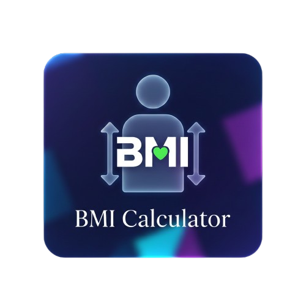

<div align="center">
  
  <h1> 💎 Glassmorphism BMI Calculator </h1>
  <p><b>A sleek, modern health tool built with glassmorphism design principles and personalized age insights.</b></p>

  
  
  
</div>

---

### 🔭 Mission Briefing
This project is a high-aesthetic web application that utilizes **Glassmorphism**—a modern design trend characterized by translucent, frosted-glass effects. It calculates Body Mass Index (BMI) and provides personalized feedback based on user height, weight, and an optional age parameter.

---

### 🚀 Key Features
- **Frosted Glass UI:** Implemented using advanced `backdrop-filter` and transparency layers.
- **Personalized Insights:** Optional **Age Input** that adjusts the feedback narrative for the user.
- **Responsive Layout:** Fully optimized for mobile, tablet, and desktop viewports using Flexbox.
- **Dynamic Feedback:** Instant weight category classification (Underweight, Normal, Overweight, Obese) with visual color coding.

---

### 🛠️ Arsenal (Tech Stack)
* **Structure:** HTML5
* **Logic:** Vanilla JavaScript (ES6+)
* **Styling:** CSS3 (Custom Properties, Backdrop-filter, & Glassmorphic UI)

---

### 📥 Deployment & Installation

1. **Clone the repository:**
   ```bash
   git clone [https://github.com/primestudio149-lang/glassmorphism-calculator.git](https://github.com/primestudio149-lang/glassmorphism-calculator.git)
 2. **Run Locally:** Open index.html in any modern web browser to view the interface.
